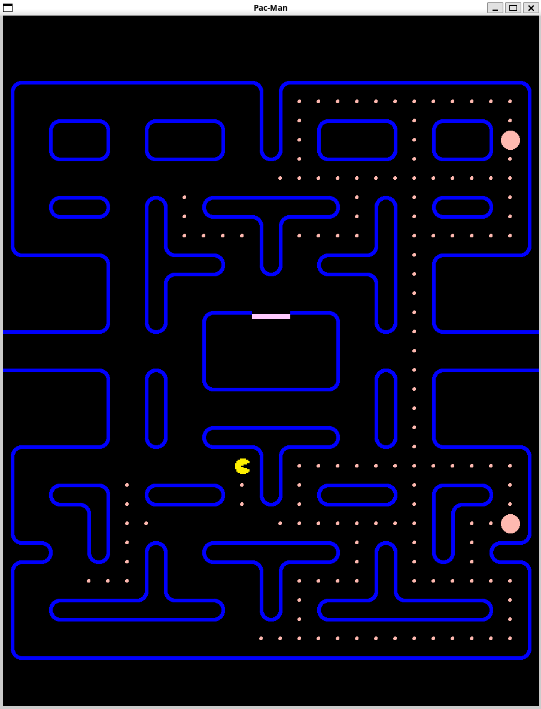

# Tappa n.7
## Obiettivo
L'obiettivo in questa tappa del progetto "Pac-Man" è quello di implementare il powerpellet.
## Ostacoli
Il pathfinding dei fantasmi per il ritorno alla casa.
## Soluzione
Si è utilizzato un algoritmo BFS calcolando sul momento la tile `GHOST_DOOR` più vicina al fantasma in quel momento.

