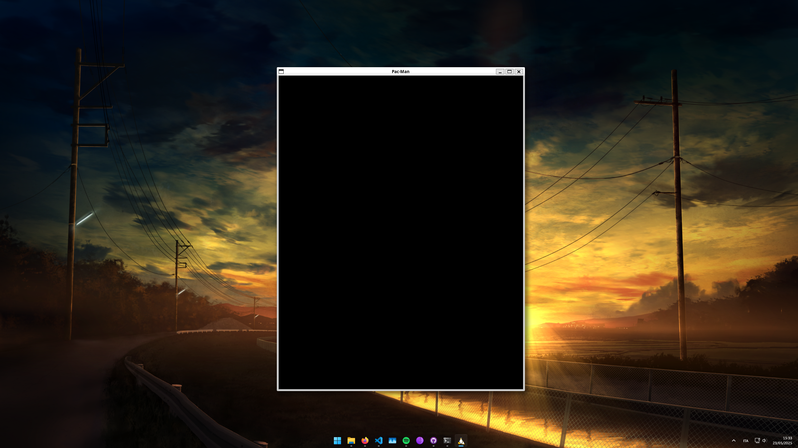

# Tappa n.1
Provando a disegnare la finestra principale dell'applicazione, è emerso che per schermi di dimensione diversa avere dei valori fissi per la larghezza e l'altezza non era una buona idea. Quindi per evitare di dover "hardcodare" i valori di larghezza e altezza, è stato deciso di renderla responsiva.
Per fare ciò si calcola il ratio della mappa e delle dimensioni della finestra, se il ratio della mappa è maggiore allora useremo il 70% della larghezza della finestra, altrimenti useremo il 70% dell'altezza della finestra. In questo modo la mappa si adatterà alla finestra.

