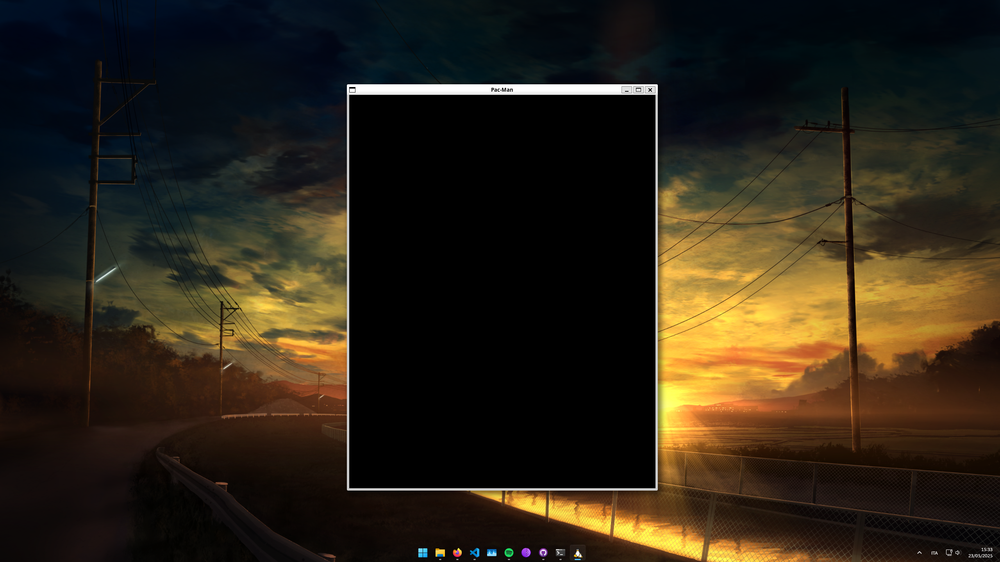

# Tappa n.1: La Finestra Principale e la Questione delle Dimensioni

Mentre iniziavo a lavorare sulla finestra principale dell'applicazione, mi sono reso conto subito di un problema critico: usare valori fissi per larghezza e altezza creava delle difficoltà significative su schermi di dimensioni diverse. Questa dipendenza da dimensioni "hardcodate" rendeva l'interfaccia tutt'altro che ottimale e decisamente poco flessibile.

## La Soluzione: Una Finestra Responsiva

Per superare questa limitazione, la mia scelta è stata quella di rendere la finestra **responsiva**. Questo significa che ora le sue dimensioni e la visualizzazione della mappa si adattano dinamicamente allo spazio disponibile.

Ecco come ho implementato il meccanismo di adattamento:

1.  **Ho Calcolato il Rapporto:** Ho determinato il rapporto d'aspetto (ratio) sia della mappa che della finestra corrente.
2.  **Ho Implementato l'Adattamento Intelligente:**
    * Se il **rapporto della mappa è maggiore** (indicando che la mappa è più "orizzontale"), faccio in modo che la mappa occupi il **70% della larghezza** della finestra.
    * Altrimenti (se la mappa è più "verticale"), la mappa occuperà il **70% dell'altezza** della finestra.

Questo approccio mi garantisce che la mappa venga sempre visualizzata in modo proporzionato e senza distorsioni, indipendentemente dalle dimensioni dello schermo.

---

## Indagine e Riferimenti
Prima di lavorare al gioco vero e proprio, ho dedicato del tempo a esplorare le regole e meccaniche di gioco. Per fare ciò, ho consultato diverse fonti online, tra cui wiki e video di gameplay su Youtube.

---

**Fonti utilizzate in questa Tappa:**
* [Wiki di Pac-Man](https://pacman.holenet.info/)
* [Video di riferimento 1](https://www.youtube.com/watch?v=i_OjztdQ8iw)
* [Video di riferimento 2](https://www.youtube.com/watch?v=AuoH0vz3Mqk)
* [Discussione su come gestire diverse risoluzioni di schermo](https://en.sfml-dev.org/forums/index.php?topic=18783.0)
---