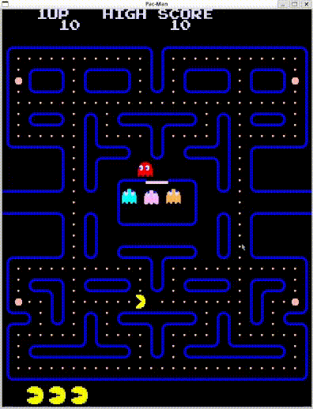

# Tappa n.10: Le Animazioni Prendono Vita

L'obiettivo di questa tappa del progetto Pac-Man è stato  implementare le **animazioni**.

Per farlo, mi sono basato su una risorsa esterna (vedi la sezione **Fonti utilizzate in questa Tappa**) che mi ha guidato nell'approccio. In pratica, ho gestito le animazioni usando un **vettore di "frame"**, ognuno con una durata associata. Il tempo trascorso viene aggiornato, ad esempio, nella funzione `move` del `Ghost`. Il sistema controlla continuamente se il tempo trascorso è maggiore della durata del frame corrente. Se lo è, si passa al frame successivo e il tempo viene "sottratto" dalla durata del frame precedente, creando un ciclo continuo. Questo permette di avere animazioni fluide e con tempi precisi.

In questa fase, ho anche dedicato del tempo ad aggiornare lo sprite-sheet: ho rimosso lo sfondo nero, rendendolo trasparente. Adesso le texture sono molto più rifinite e si integrano meglio nel gioco.

---

---
**Fonti utilizzate in questa Tappa:**
* [Tutorial sulle animazioni negli sprite-sheet](https://stackoverflow.com/questions/52655335/animating-sprites-in-sfml-from-a-sprite-sheet)
---
