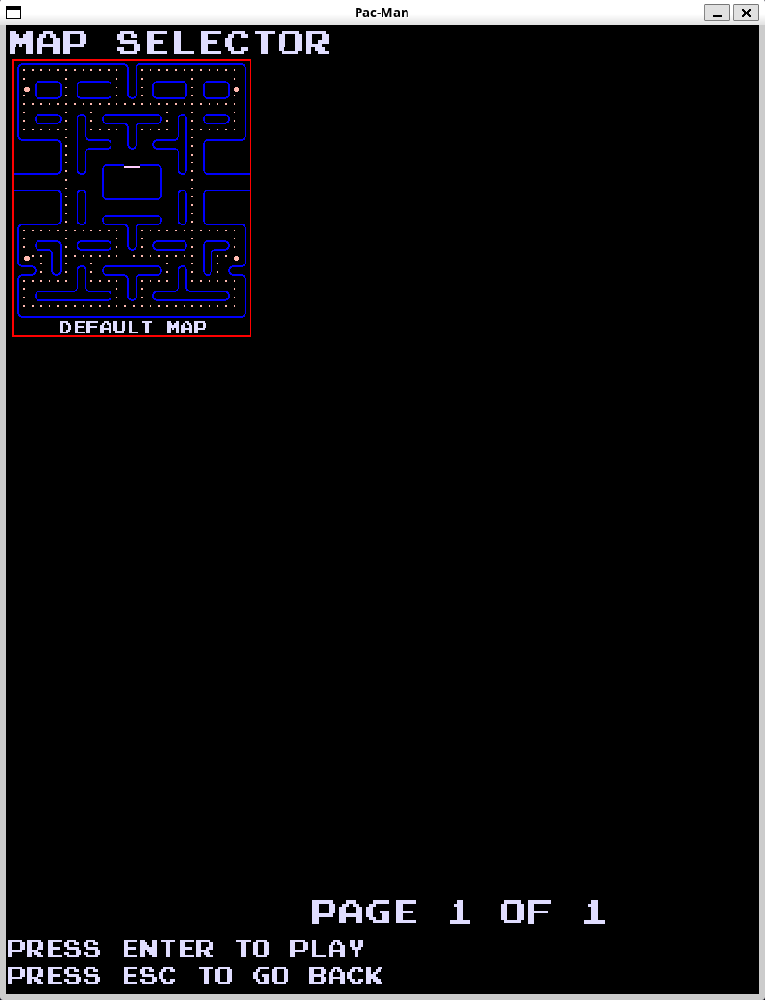

# Tappa n.11: Il Selettore di Livelli

L'obiettivo di questa tappa del progetto Pac-Man è stato implementare un **menu per scegliere il layout della mappa** da giocare. Ho pensato a questo sistema anche in previsione di un futuro editor di livelli.

## Come Funziona il Selettore di Livelli

Ho creato un nuovo file `LevelSelectorState` che gestisce tutta la logica di questa schermata. All'avvio, `LevelSelectorState` si occupa di caricare tutte le mappe disponibili da una cartella dedicata. Per ogni mappa, genero un'**anteprima visuale** che mostra il layout del livello, completa di pallini, muri e porte dei fantasmi.

Queste anteprime vengono poi disposte in una griglia nel menu. Ho implementato una logica di **paginazione** che mi permette di navigare tra diverse pagine di mappe se ce ne sono troppe da mostrare contemporaneamente. Un **cursore** rosso evidenzia la mappa attualmente selezionata, e ho aggiunto le funzioni per muoverlo con le frecce direzionali e cambiare pagina. Sotto le anteprime, visualizzo il numero di pagina corrente e le istruzioni per iniziare il gioco o tornare indietro.

Infine, per rendere i nomi delle mappe più leggibili, ho creato una funzione `prettify` che pulisce i nomi dei file rimuovendo estensioni e caratteri non pertinenti, trasformandoli in un formato più user-friendly per la visualizzazione nel menu.

---

**Fonti utilizzate in questa Tappa:**

* [Come rimuovere l'estensione da un nome di file in C++](https://stackoverflow.com/questions/6417817/easy-way-to-remove-extension-from-a-filename)
* [Sostituire o rimuovere caratteri non corrispondenti a regex in C++](https://stackoverflow.com/questions/28963810/replace-or-remove-characters-that-are-not-in-regex-with-c)

---

