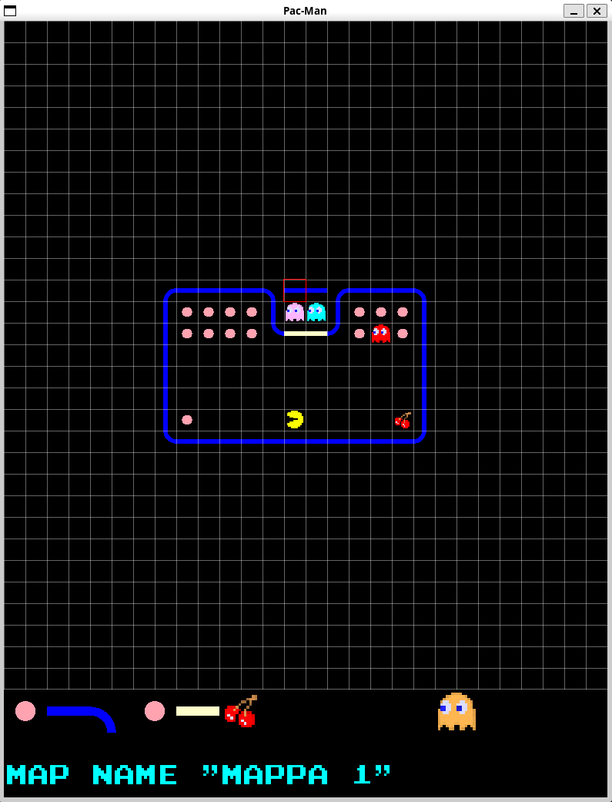
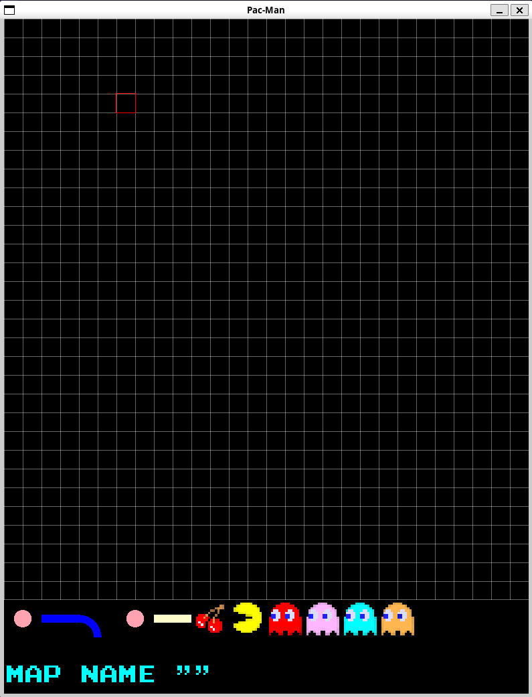

# Tappa n.12: L'Editor di Mappe

L'obiettivo principale di questa tappa del progetto Pac-Man è stato implementare un vero e proprio **editor di mappe**, che permette sia di creare nuove mappe da zero che di modificare quelle esistenti.

## Riorganizzazione del Progetto e Nuovi Componenti

Per gestire la complessità dell'editor, ho aggiornato l'intera struttura del progetto, suddividendo i file in categorie più logiche: `core`, `game_elements`, `lib`, `map_editor`, e alcuni file più generici.

Una delle novità più significative è l'introduzione di **`TileFactory`**. Questa classe è diventata un punto centrale per la gestione delle tile: si occupa di caricare tutte le texture necessarie (muri, pallini, Pac-Man, fantasmi, frutti, ecc.) direttamente dagli sprite-sheet, applicando scalature e rotazioni quando serve. Ora, grazie a `TileFactory`, la funzione di disegno della mappa è molto più semplice e pulita, dato che non deve più preoccuparsi di caricare e configurare ogni singola texture. Ho anche aggiornato `GameState` per utilizzare `TileFactory`.

Ho anche messo mano a `GameMenu`, che ora è molto più flessibile. Non gestisce più solo le opzioni, ma anche l'input da tastiera in autonomia, e ogni opzione del menu ha un'azione specifica associata. Questo ha eliminato la necessità di fare confronti complessi con la posizione del cursore. Lo stesso principio è stato applicato a `LevelSelectorState`, che ora uso anche nell'editor di mappe per selezionare la mappa da modificare.

## Il Cuore dell'Editor

La novità di questa tappa è l'**editor di mappe**. La sua base operativa è la stessa sia per la creazione che per la modifica. Funziona così: c'è un parametro che viene passato solo quando si sceglie di "modificare" una mappa esistente: il nome della mappa. Se questo nome non viene passato (quindi stiamo "creando"), mi trovo di fronte a una griglia completamente vuota, pronta per essere riempita. Se invece il nome c'è, la mappa corrispondente viene caricata, e posso iniziare a modificarla.

---
**Fonti utilizzate in questa Tappa:**
* [Conversione delle coordinate del mouse](https://www.sfml-dev.org/tutorials/3.0/graphics/view/#coordinates-conversions)
* [Sostituire gli spazi con underscore in una stringa](https://stackoverflow.com/questions/5252612/replace-space-with-an-underscore)

---

