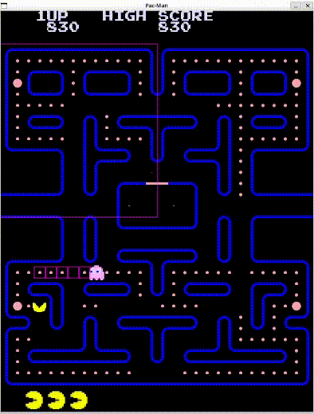
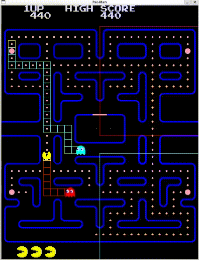
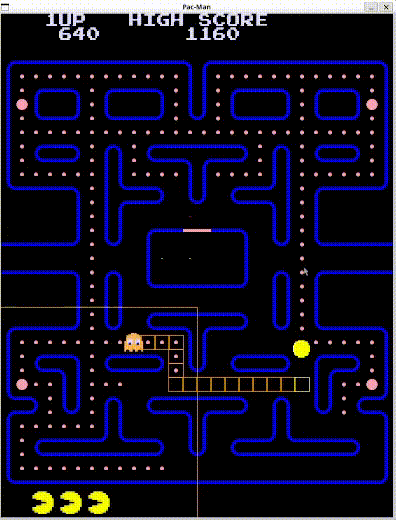

# Tappa n.13: Miglioramenti all'IA dei fantasmi
L'obiettivo di questa tappa è quella di migliorare l'attuale intelligenza artificiale dei fantasmi cambiando quella attuale (randomica) in una più vicina a quella originale.

## Cambiamenti generali
In questa tappa è stata aggiunta la funzione `update(float elapsed)` che sarà usata dal Game Manager e gestisce i timer interni del fantasma (ad esempio, il timer per il comportamento spaventato o la gestione degli stati CHASE e SCATTER), gestisce anche il movimento e l'animazione.

Per gestire il comportamento dei singoli fantasmi è stata aggiunta una funzione `virtual behaviour()` che sarà implementata da ciascun fantasma e verrà chiamata da `move()`.

Per la modalità SCATTER il comportamento è lo stesso per ogni fantasma: prende la posizione di un `IntRect` che rappresenta l'area in cui il fantasma deve muoversi che ogni fantasma ha nel proprio costruttore, e quando è in modalità SCATTER calcola la BFS per arrivare nell'angolo in alto a sinistra (dell'`IntRect`) e se quella posizione specifica è considerato un muro allora il programma cerca la tile più vicina libera e imposta quella come target della BFS e una volta al suo interno si muove liberamente fino a quando è dentro all'area altrimenti ricalcola la BFS per tornare dentro.

La scelta randomica della direzione dei fantasmi è stata sostituita con una più simile all'originale: randomicamente sceglie una direzione, se quella direzione è un muro allora in senso orario trova la prima direzione libera e prende quella.

Per rendere il passaggio di stato da `EATEN` a `IN_HOUSE` e da `IN_HOUSE` a `SCATTER/CHASE` più fluido, sono stati aggiunti due stati: `ENTERING_HOUSE` e `EXITING_HOUSE`. In questo modo si evitano cambiamenti bruschi di stato che portavano (seppur raramente) a comportamenti indesiderati quali il fantasma bloccato dentro la casa.

## Blinky
Blinky (il fantasma rosso) ha come comportamento quello di seguire direttamente il giocatore. Per fare ciò, quando è allineato alla cella e la posizione del giocatore è cambiata, calcola il percorso usando la ricerca BFS.

## Pinky
Pinky (il fantasma rosa) ha un comportamento simile a Blinky, ma invece di seguire direttamente il giocatore, cerca di anticiparne i movimenti. Quando è allineato alla cella e la posizione del giocatore è cambiata, calcola il percorso usando la ricerca BFS per raggiungere la posizione in cui il giocatore si sposterà ovvero 4 caselle in avanti rispetto alla direzione che sta seguendo Pac-Man.

## Inky
Inky (il fantasma ciano) ha un comportamento unico e più complicato rispetto agli altri fantasmi: per calcolare la tile di destinazione, Inky tiene conto della posizione di Blinky e della direzione in cui si sta muovendo Pac-Man e ne calcola un vettore e poi lo raddoppia. La formula che utilizza Inky per calcolare la destinazione è la seguente:
$$
\footnotesize
\text{pacmanOffset} = \text{pacmanPosition} + \text{pacmanDirection} * 2 \\
\text{destination} = \text{pacmanOffset} + 2 * (\text{pacmanOffset} - \text{blinkyPosition})
$$

## Clyde
Clyde (il fantasma arancione) ha un comportamento simile a Blinky, ma con una differenza chiave: quando si trova a una certa distanza da Pac-Man (meno di 8 tile di distanza euclidea), inizia a muoversi verso il suo angolo preferito invece di inseguirlo direttamente.

---
**Fonti utilizzate in questa Tappa:**
* [Wiki di Pac-Man](https://pacman.holenet.info/)
---