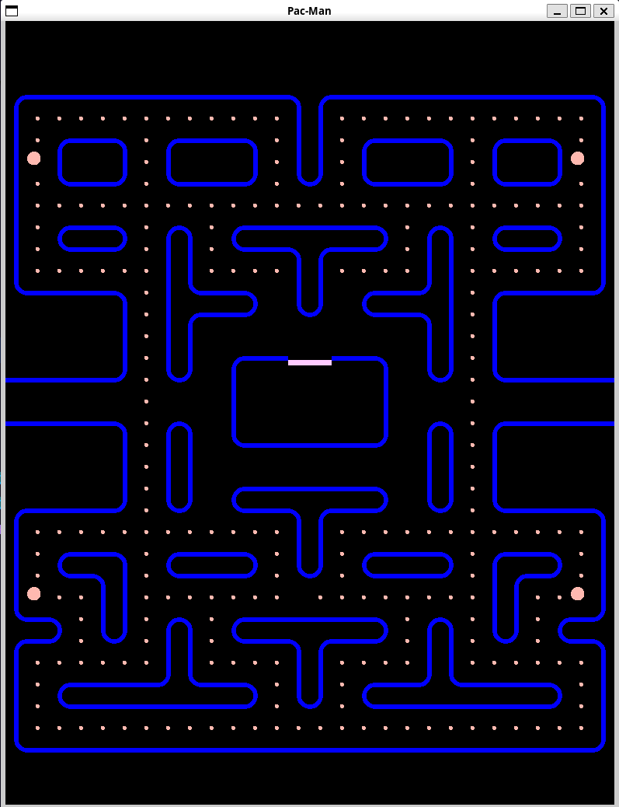

# Tappa n.2
In questa tappa ci si è concentrati sulla creazione di un sistema di disegno per la mappa del gioco, che permette di visualizzare il mondo di gioco e le sue caratteristiche. Il sistema di mappa è stato progettato per essere modulare e facilmente estendibile, in modo da poter aggiungere nuove funzionalità in futuro.

In questa tappa è stato riscontrato un problema con la visualizzazione della mappa: usciva dal campo visivo del giocatore. Per risolvere questo problema, è stata usata una vista che "comprime" la mappa nell'area visibile al giocatore.

