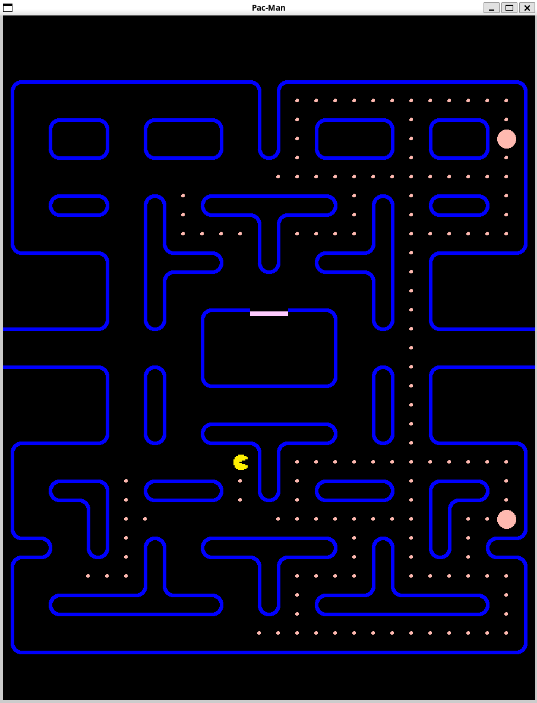

## Tappa n.3: Pac-Man Prende Vita: Movimento e Interazioni

In questa tappa, l'obiettivo principale è stato dare vita a **Pac-Man**. Ho implementato il suo movimento caratteristico, includendo il fondamentale "buffer" per la prossima direzione. Ho gestito le **collisioni con le pareti** e il **teletrasporto** da un lato all'altro della mappa (l'effetto Pac-Man). Inoltre, ho curato l'illusione che Pac-Man stia effettivamente "mangiando" i pallini. Rispetto alla tappa precedente, ho aggiunto anche la funzione `handle()` per gestire tutti gli eventi legati al movimento di Pac-Man.

---

### La Sfida: Movimento Fluido e Cambio Direzione Preciso

L'ostacolo maggiore che ho affrontato è stata l'implementazione del movimento per ottenere sia una **fluidità in linea con la griglia** sia la possibilità di **cambiare direzione non appena possibile**, grazie al "buffer".

Per il **movimento fluido**, uso due vettori: uno di interi per tracciare la posizione di Pac-Man nella matrice del gioco, e uno di `float` che mi serve per rendere l'animazione di movimento davvero scorrevole.

Per quanto riguarda il **cambio di direzione "al volo"**, ho introdotto una variabile di tipo `Direction`. Questa variabile contiene la direzione desiderata in cui Pac-Man deve muoversi non appena il blocco in quella direzione si libera. Per realizzare ciò, ho creato una funzione che controlla due cose fondamentali: primo, che il blocco di destinazione non sia un muro; secondo, che Pac-Man sia sufficientemente allineato al centro della tile (con un piccolo margine di tolleranza). Quest'ultima parte è possibile proprio grazie al vettore di `float`, i cui valori oscillano tra -1 e 1 circa, permettendomi un controllo preciso sul posizionamento.

---

---
**Fonti utilizzate in questa Tappa:**
Nessuna fonte esterna è stata utilizzata in questa tappa, poiché ho applicato conoscenze già acquisite in precedenza.
---