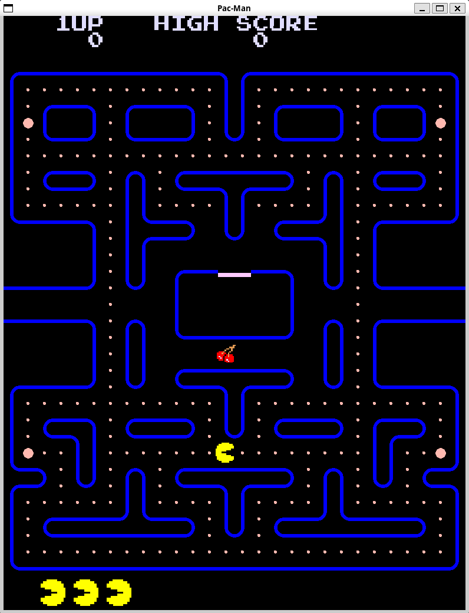

# Tappa n.4: Interfaccia Utente e Ottimizzazioni

In questa tappa, mi sono concentrato sull'implementazione di una **UI essenziale**, rendendo il gioco più completo. Ho aggiunto la visualizzazione del **punteggio**, dell'**high score**, il conteggio delle **vite rimanenti** e l'indicazione dei **frutti/oggetti raccolti**. Ho anche apportato delle modifiche per prendere le texture di Pac-Man direttamente da un **foglio di sprite**.

## Gestione degli Sprite, Testo e Risoluzione del Memory Leak

A tal proposito, ho creato una funzione `createSprite`: prende come input diverse informazioni, inclusa la posizione esatta in coordinate della parte di immagine che mi interessa estrarre dallo sprite-sheet, e mi restituisce lo sprite pronto all'uso.

Ho anche implementato un **sistema per scrivere i caratteri**, usando una mappa dove associo ogni carattere alla sua posizione specifica nello sprite-sheet dedicato al testo. Questo mi ha permesso di visualizzare tutti gli elementi testuali della UI in modo efficace.

Durante i test, però, ho notato un **leak di memoria** che era causato dalla matrice che contiene la mappa. Per risolvere questo problema, ho cambiato l'implementazione: invece di una matrice a dimensione fissa, ho optato per una **matrice di vettori**.

---

