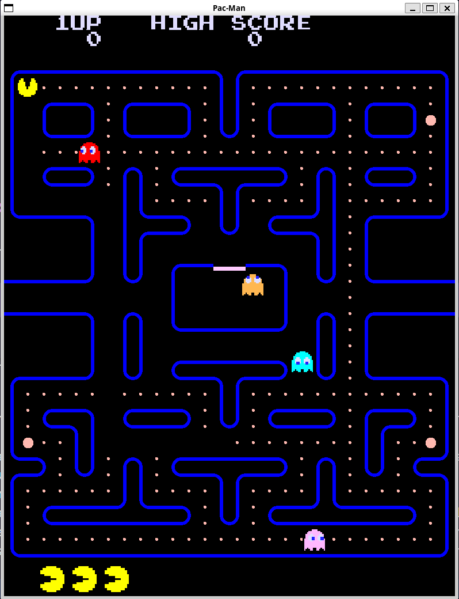

# Tappa n.5
## Obiettivo
L'obiettivo in questa tappa del progetto "Pac-Man" è quello di implementare i fantasmi e il loro movimento. In questa fase non consideriamo i behaviours specifici dei fantasmi, ma ci concentriamo solo sul loro movimento. I fantasmi si muovono in modo casuale all'interno della mappa.
## Ostacoli
L'ostacolo principale è stato quello di trovare il modo migliore per far uscire i fantasmi dalla casa senza intrappolarli.
## Soluzione
Salvo in un vettore tutte le tile che sono considerate le porte della casa. Una volta che la mappa è stata impostata nel fantasma, viene calcolata quale tile di uscita è più vicina alla posizione del fantasma.
Ogni fantasma ha uno stato che dice se è in casa o no, inoltre c'è anche un "dot limit" che indica quando è che il fantasma deve uscire dalla casa. Una volta che viene superata questa soglia, il fantasma esce dalla casa avvicinandosi alla tile di uscita selezionata impostando la direzione "manualmente" e una volta uscito lo stato viene cambiato come "non in casa" e da quel momento in poi le porte della casa vengono considerate come muri facendo sì che il fantasma non possa più rientrare in casa.

