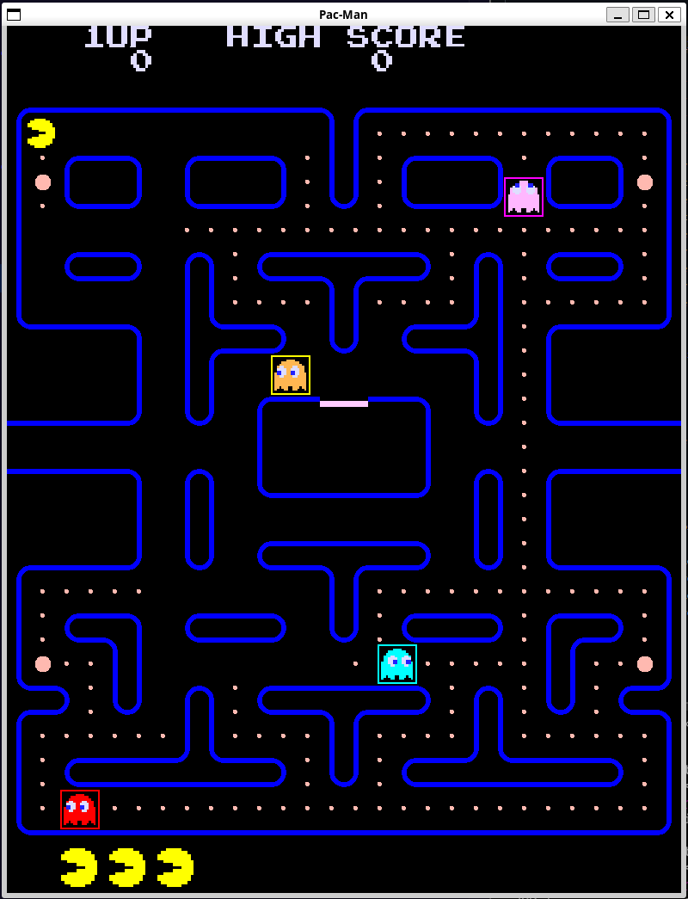

# Tappa n.6: Collisioni e Gestione delle Vite

In questa tappa, l'obiettivo era implementare la **collisione dei fantasmi con Pac-Man** e la conseguente gestione delle vite del giocatore. L'idea è semplice: in caso di collisione, Pac-Man perde una vita e viene immediatamente riportato alla sua posizione iniziale. Se Pac-Man esaurisce tutte le vite, ho impostato un flag che indica la fine del gioco.

Per controllare se un fantasma "mangiava" Pac-Man, ho calcolato la **distanza euclidea tra i due oggetti**. Se questa distanza è inferiore a un certo valore, definito dalla costante `COLLIDE_BOX`, allora si attiva un reset del round (quindi si resettano le posizioni di tutti gli elementi) e la vita di Pac-Man viene decrementata. Nel caso in cui Pac-Man non abbia più vite, il flag `game_over` viene settato a `true`, mettendo il gioco in pausa e di fatto terminandolo.

Inoltre, per migliorare l'organizzazione del codice, ho spostato tutta la logica relativa al caricamento e al disegno della mappa, della finestra e di tutti gli altri elementi grafici fuori dal `main` e l'ho raggruppata in un nuovo file, `State.cpp`.

---

---
**Fonti utilizzate in questa Tappa:**
* [Discussione su come calcolare la distanza tra due punti](https://it.mathworks.com/matlabcentral/answers/16848-how-to-find-distance-between-two-points)
* [Distanza Euclidea](https://it.wikipedia.org/wiki/Distanza_euclidea)
---