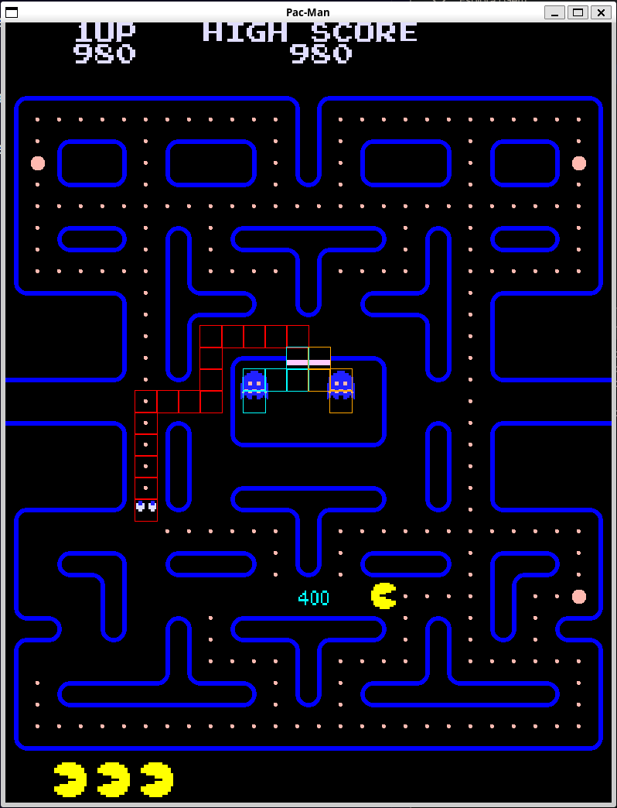

# Tappa n.7
L'obiettivo in questa tappa del progetto "Pac-Man" è quello di implementare il powerpellet. Quando PacMan lo mangia, i fantasmi devono cambiare il loro stato e la texture e la velocità. Tutti i fantasmi si spaventano (anche quando sono in casa) ma una volta che vengono mangiati e tornano a casa non sono più spaventati dal powerpellet in corso. Il powerpellet ha una durata limitata che però si resetta ogni volta che PacMan mangia un powerpellet. Bisogna tenere conto anche della streak dei fantasmi mangiati durante **un** powerpellet e la formula per calcolare il punteggio di quando un fantasma viene mangiato è $$200\cdot 2^{\text{streak}} \quad \text{streak}\in\{0,3\}$$
Il fantasma quando entra nella modalità ``SCARED`` deve andare nella direzione opposta a quella che sta avendo. 

Una funzionalità che è stata ostica da implementare è stata il pathfinding dei fantasmi per il ritorno alla casa.

Si è utilizzato un algoritmo BFS calcolando la tile `GHOST_DOOR` più vicina al fantasma in quel momento.

