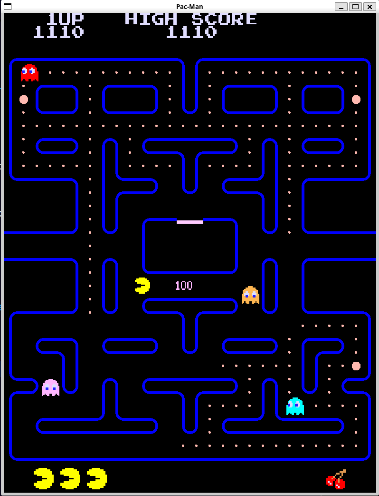

# Tappa n.8: I Frutti

In questa tappa, l'obiettivo è stato implementare il sistema di **istanziamento dei frutti** all'interno della mappa. Ho fatto in modo che compaiano in una posizione specifica, che ho indicato con il carattere "F" nella configurazione della mappa.

Il **despawn** del frutto è impostato casualmente tra i 9 e i 10 secondi, ma c'è un dettaglio importante: si "congela" se Pac-Man ha un power pellet attivo. Questo significa che il frutto rimane visibile finché l'effetto del power pellet non termina.

Il **tipo di frutto** dipende dal livello in cui ci troviamo (ad esempio, al livello 1 apparirà sempre la Ciliegia, come da tradizione di Pac-Man). I frutti compaiono sempre due volte per livello: una volta dopo che Pac-Man ha mangiato 70 pallini e una seconda volta dopo 170 pallini, ma solo se il primo frutto non è più presente sullo schermo. Per i riferimenti specifici sui frutti, ho consultato la [pagina dedicata di Pac-Man Fandom](https://pacman.fandom.com/wiki/Fruits).

Come per i fantasmi, anche qui ho adottato un approccio modulare: ho un file generico `Fruit` e poi dei file specifici per ogni tipo di frutto. Questi ultimi passano al file generico la posizione esatta della loro texture nello sprite-sheet e il punteggio associato.

---

