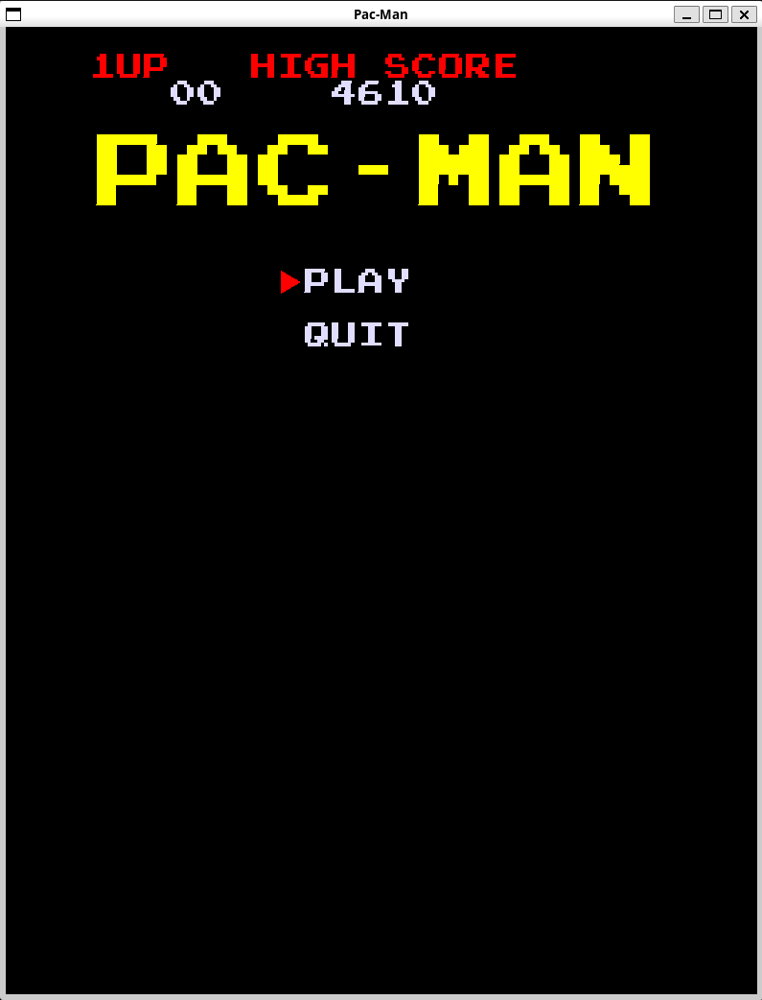
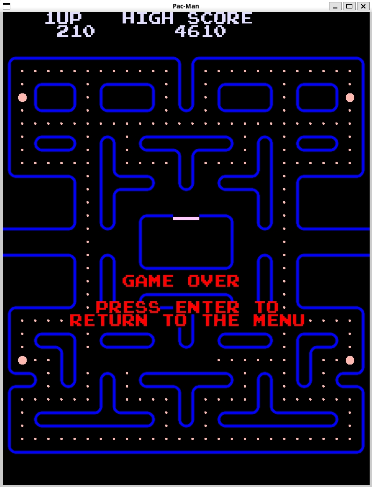
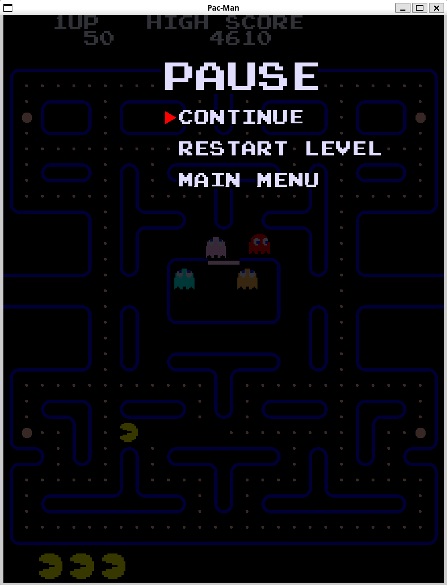
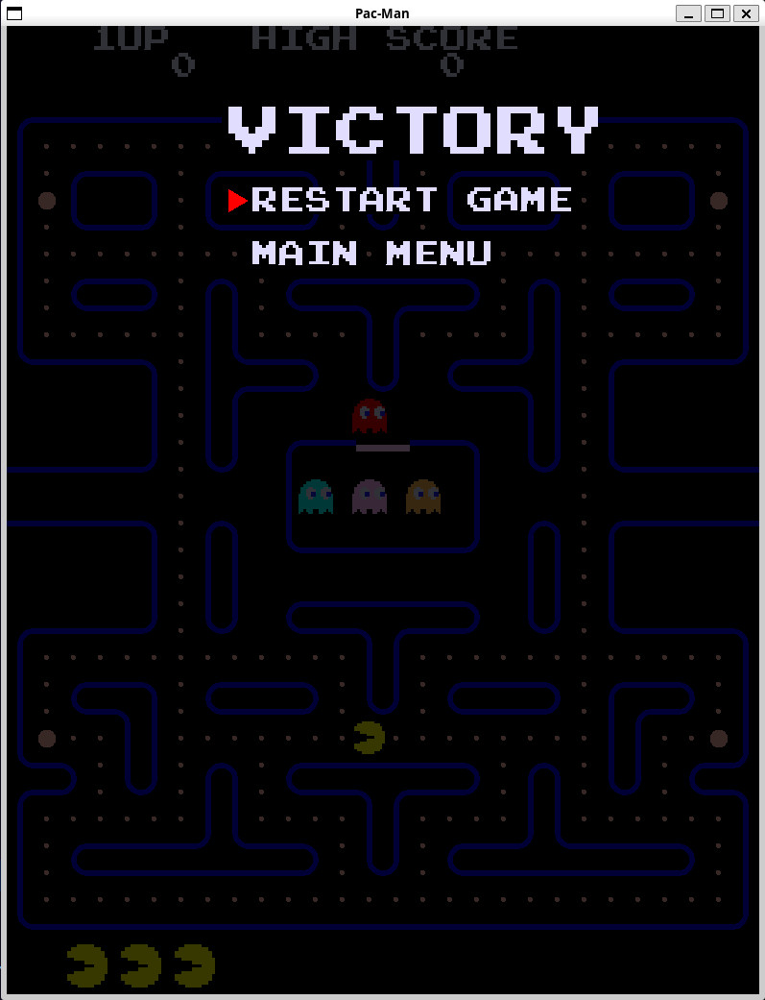

# Tappa n.9
## Obiettivo
L'obiettivo in questa tappa del progetto "Pac-Man" è quello di implementare le varie schermate del gioco (game over, pausa, menu principale e schermata di vittoria).
## Ostacoli

## Soluzione

  
